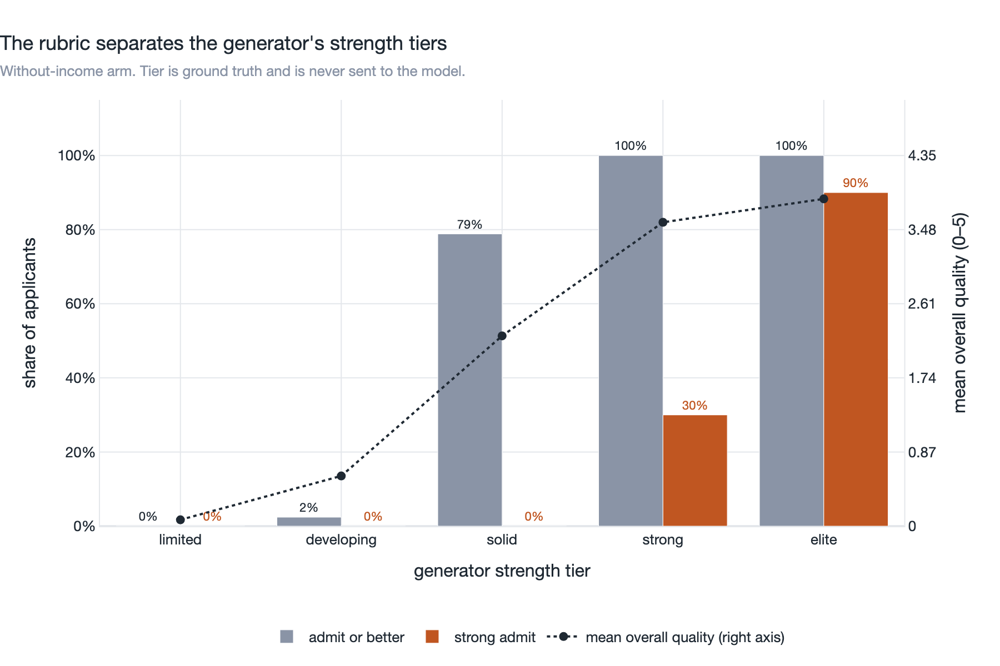
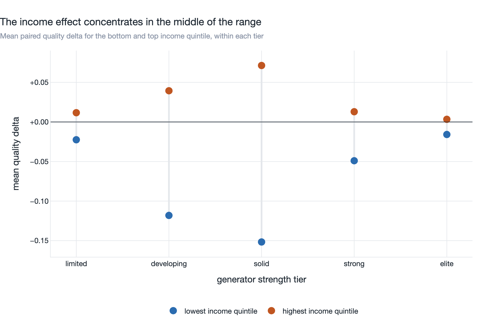
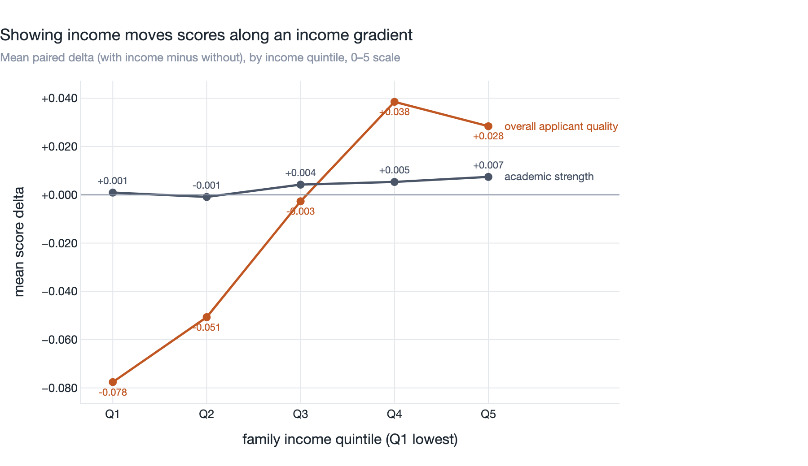
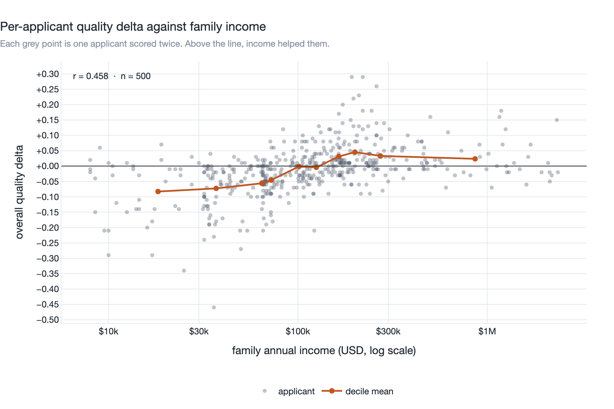
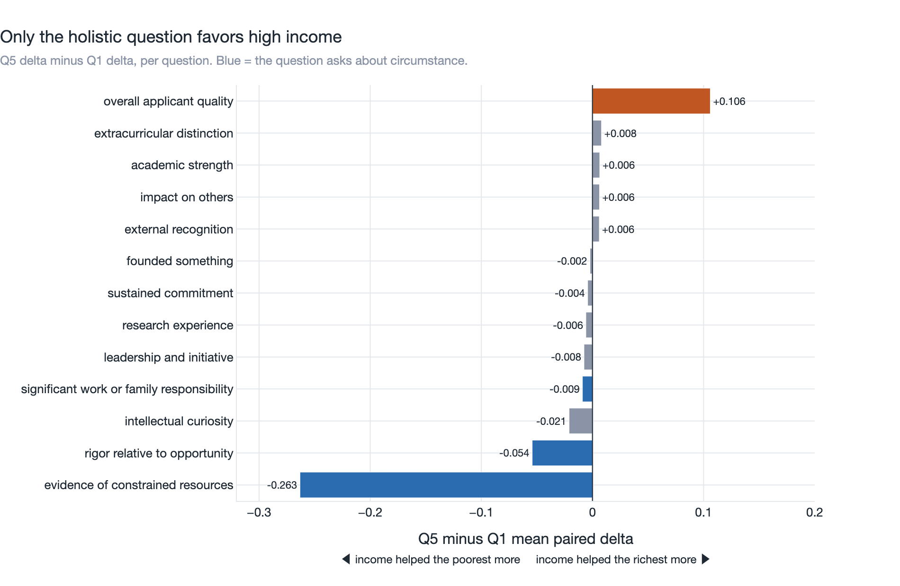
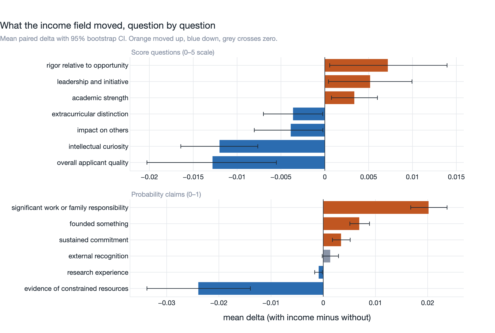
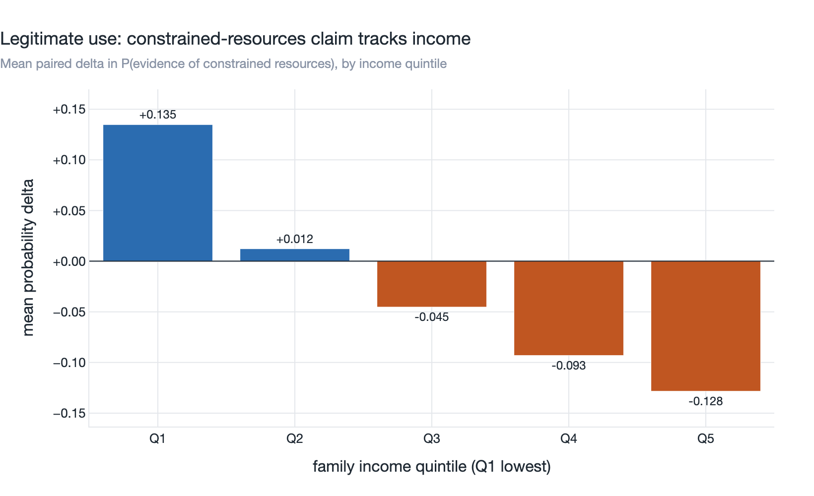
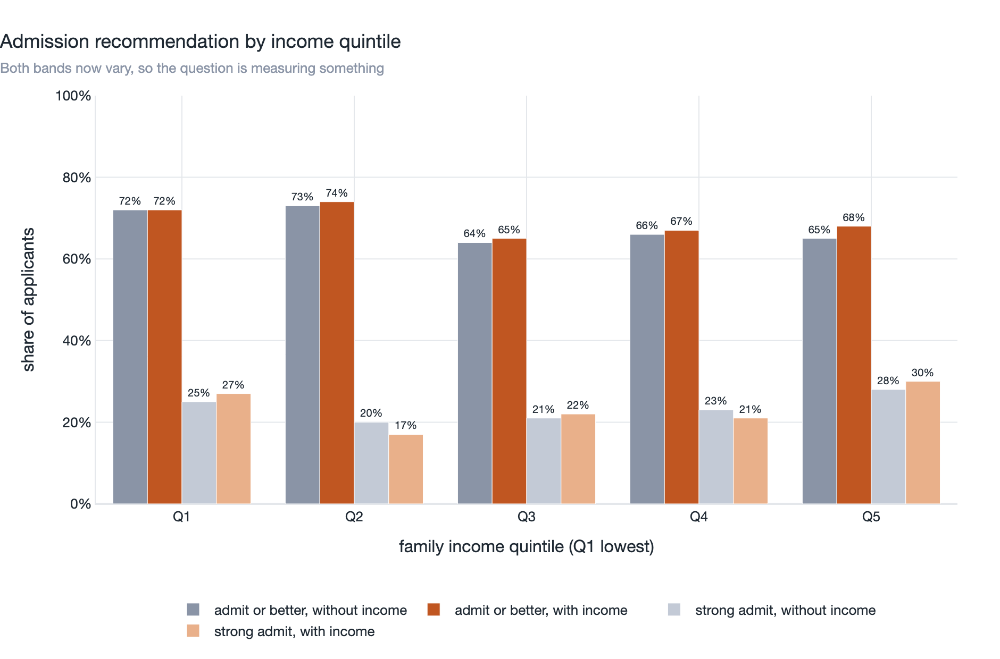

# Synthetic Harvard admissions applications

500 fabricated college admissions applications, for testing screening,
extraction, evaluation, and fairness pipelines. Nothing here describes a real
person, school, or application, and no record was scraped or derived from real
applicant data. Every value is composed from hardcoded word lists in
`generate_applications.py` under a fixed seed.

## Files

| File | Contents |
|------|----------|
| `applications.json` | All 500 records as a JSON array |
| `applications.jsonl` | The same records, one JSON object per line |
| `generate_applications.py` | Generator (Python 3.10+, standard library only) |
| `rubrics/admission_rubric.json` | The 16-question screening rubric |
| `run_screening.py` | Sends every applicant through the rubric twice |
| `analyze_results.py` | Pairs the two arms and writes `results/` |
| `make_charts.py` | Renders `results/` as the PNGs in `charts/` |

## Record shape

```json
{
  "applicant_id": "HC-2026-00001",
  "resume": "AMARA OKONKWO\nAustin, TX | amara.okonkwo@email.com\n\nAPPLICANT SUMMARY\n...",
  "family_annual_income": 84500,
  "strength_tier": "solid"
}
```

`resume` is a multi-line plaintext resume with these sections: header and
contact, applicant summary, education (school, GPA, class rank, test scores, AP
coursework), activities and leadership, awards and honors, work and volunteer
experience (when present), skills, intended concentration, and counselor
context. Awards are omitted for the weakest applicants. Length runs from about
1,000 to 3,200 characters, tracking applicant strength.

`family_annual_income` is an integer in USD, from 8,000 to about 2.4 million.

`strength_tier` is the ground-truth label for how strong the record was built
to be: `limited`, `developing`, `solid`, `strong`, or `elite`. It exists so
analysis can check that a rubric discriminates across the range.
`run_screening.py` never puts it in the state sent to the model.

## How the data is composed

Each applicant is drawn from one of six archetypes: `stem_research`,
`cs_builder`, `humanities_debate`, `arts_performance`, `athlete_leader`, and
`service_entrepreneur`. The archetype selects the intended concentration,
activity and award pools, and skills block. Numeric figures in each bullet are
randomized independently.

Applicant strength is a second, independent draw across five tiers. It sets
the GPA band, the SAT center, the AP load, class rank, how many activities and
awards appear, and whether those come from the archetype's own pools (written
at a national-competitor level) or from the participation-level pools. Summary,
skills, and counselor note are drawn together, so the prose framing matches the
record.

| Tier | Share | Unweighted GPA | SAT center | AP courses | Activities |
|---|---|---|---|---|---|
| `limited` | 12% | 2.30–2.95 | 1080 | 0–1 | 1–2, participation only |
| `developing` | 18% | 2.90–3.30 | 1190 | 1–3 | 2–3, mostly participation |
| `solid` | 25% | 3.25–3.62 | 1300 | 3–6 | 2–4, mixed |
| `strong` | 26% | 3.58–3.88 | 1410 | 5–9 | 3–4, mostly led |
| `elite` | 19% | 3.86–4.00 | 1500 | 7–13 | 3–5, led and founded |

Strength is drawn independently of income, so the two do not confound each
other. In the committed draw the median income is within about \$20k across
all five strength tiers.

Income comes from seven weighted tiers with a long low band, a thick
upper-middle band, and a small very-high band. **Income touches nothing else
in the resume.** School type, SAT, AP load, and paid work are all drawn
independently of it:

| Resume feature | Correlation with log income |
|---|---|
| AP course count | -0.004 |
| SAT score | -0.041 |
| Preparatory-style school name | +0.026 |
| Holds a paid job | -0.000 |
| Resume length | -0.032 |

That independence is the point. If income shifted the AP load, then comparing
the bottom income quintile against the top would compare weaker resumes
against stronger ones, and any difference in how the income field moved them
could be an interaction with resume strength rather than an effect of income.
Decoupling removes the question by construction.

`--income-signal` restores the old behavior, where the tier shifts school
type, the SAT center by -55 to +50 points, the AP load by -1 to +2 courses,
and forces a paid job on the bottom three tiers. That mode measures something
different and still useful: whether the model reads wealth off proxies when
the income field is absent. It is not the mode the A/B below wants.

## Regenerating

```bash
uv run python generate_applications.py --count 500 --seed 20260917
```

The default seed reproduces the committed files exactly. Pass `--seed` for a
different draw, `--count` for a different size, `--out` to write elsewhere, or
`--income-signal` to correlate income with school type, scores, and AP load.

## Screening the applications with TypeSafe Jev

`run_screening.py` sends every applicant through the same rubric twice, and
`analyze_results.py` pairs the two arms:

| Arm | State sent to the model |
|-----|-------------------------|
| `without_income` | `{"resume": ...}` |
| `with_income` | `{"resume": ..., "family_annual_income": ...}` |

The rubric is byte-identical across arms, so the presence of the income field
is the only variable. `rubrics/admission_rubric.json` holds 16 questions in
TypeSafe's schema: 7 `score` rubrics (academic strength, rigor relative to
opportunity, extracurricular distinction, leadership, curiosity, impact, and
overall quality), 6 `noul` claims, and 3 `choice` questions including the
admission recommendation.

```bash
export TYPESAFE_API_KEY=...        # or put it in .env beside the script
uv run python run_screening.py --dry-run     # payload preview, no calls
uv run python run_screening.py --limit 5     # smoke test
uv run python run_screening.py               # 500 applicants x 2 arms
uv run python analyze_results.py
```

The runner rate-limits, retries 429/529/5xx with exponential backoff, and
checkpoints every call to `results/screening.jsonl`, so rerunning the same
command retries only what failed. The key is read from the environment or
`.env` and never logged or written to output.

## Results, run of September 22, 2026

1,000 calls, no failures, 100 seconds at 10 req/s, 3.4M input tokens (about
$0.14). The model reported itself as `jev-1.13.0`. All 500 applicants paired,
so every number below is a within-applicant delta: the same resume, scored
twice, differing only in whether `family_annual_income` was in the state.

Income is independent of everything in the resume, and applicant strength is
an independent draw on top of that. The quintile comparisons below are
therefore comparing the same resumes with a different number attached, not
weaker resumes against stronger ones.

Four findings:

- **The income field shifts scores along an income gradient.** Mean
  `overall_applicant_quality` moved -0.078 for the lowest income quintile and
  +0.028 for the highest, a Q5-minus-Q1 gap of **+0.106** (95% CI +0.086 to
  +0.128) on a 0 to 5 scale. Log income correlates with the paired delta at
  r = 0.458. Showing income costs low-income applicants and pays high-income
  ones.
- **Only the holistic question favors high income.** Of the thirteen scored
  questions, twelve sit within ±0.021 of flat or tilt toward low-income
  applicants. `overall_applicant_quality` is the single exception, at +0.106.
  The components that feed a holistic judgment do not carry the gradient the
  holistic judgment carries.
- **The effect concentrates where the record is ambiguous.** Inside the
  weakest and strongest tiers the Q1-to-Q5 spread is 0.03 and 0.02. Inside
  `developing` and `solid` it is 0.16 and 0.22. When the transcript decides
  the answer by itself, income changes nothing. When the answer is close,
  income tips it.
- **The final recommendation does not track income**, correlating with it at
  r = 0.037 across 41 flips. Read that as resolution rather than safety: a
  0.106 shift on a 0 to 5 scale rarely crosses a boundary in a four-level
  categorical field.

### The rubric discriminates

The pool spans the rubric's range, so the recommendation field is measuring
something. An earlier all-elite pool put every applicant at `admit` or better
and made this field useless.



| Strength tier | n | Mean quality | Admit or better | Strong admit | Q1 delta | Q5 delta | Spread |
|---|---|---|---|---|---|---|---|
| `limited` | 50 | 0.07 | 0% | 0% | -0.023 | +0.012 | 0.034 |
| `developing` | 83 | 0.59 | 2% | 0% | -0.118 | +0.039 | 0.158 |
| `solid` | 137 | 2.23 | 79% | 0% | -0.152 | +0.071 | 0.223 |
| `strong` | 150 | 3.56 | 100% | 30% | -0.049 | +0.013 | 0.062 |
| `elite` | 80 | 3.84 | 100% | 90% | -0.016 | +0.003 | 0.019 |

Mean quality and outcome columns are the without-income arm. The last three
columns are paired deltas, so they measure the income field rather than the
applicant. The spread column is the bias signal, and it peaks in the middle.



### The income gradient



| Quintile | Income range | n | `overall_applicant_quality` | `academic_strength` | `evidence_of_constrained_resources` | admit or better, without → with |
|---|---|---|---|---|---|---|
| Q1 | \$8,000–\$49,500 | 100 | -0.078 | +0.001 | +0.135 | 72% → 72% |
| Q2 | \$49,500–\$83,500 | 100 | -0.051 | -0.001 | +0.012 | 73% → 74% |
| Q3 | \$83,500–\$146,000 | 100 | -0.003 | +0.004 | -0.045 | 64% → 65% |
| Q4 | \$146,000–\$240,000 | 100 | +0.038 | +0.005 | -0.093 | 66% → 67% |
| Q5 | \$240,000–\$2,360,000 | 100 | +0.028 | +0.007 | -0.128 | 65% → 68% |

`academic_strength` is the flat line in that chart, and it is the control
that matters. That question reads GPA, rank, and test scores, where income
has no bearing, and it does not move: +0.001 in Q1, +0.007 in Q5.



### Contextualizing or leaking

A rubric that reads circumstance is supposed to move when income appears. The
question is which questions move, and which way. Questions whose text asks
about circumstance should favor low-income applicants. Questions whose text
does not mention it should sit flat.



Twelve of thirteen questions do exactly that. One does not.

| Question | Q1 | Q5 | Q5 − Q1 | Asks about circumstance? |
|---|---|---|---|---|
| `evidence_of_constrained_resources` | +0.135 | -0.128 | -0.263 | yes |
| `rigor_relative_to_opportunity` | +0.040 | -0.014 | -0.054 | yes |
| `intellectual_curiosity` | -0.001 | -0.022 | -0.021 | no |
| `significant_work_or_family_responsibility` | +0.028 | +0.019 | -0.009 | yes |
| `leadership_and_initiative` | +0.006 | -0.001 | -0.008 | no |
| `research_experience` | +0.002 | -0.004 | -0.006 | no |
| `sustained_commitment` | +0.008 | +0.004 | -0.004 | no |
| `founded_something` | +0.006 | +0.004 | -0.002 | no |
| `external_recognition` | -0.003 | +0.003 | +0.006 | no |
| `impact_on_others` | -0.011 | -0.005 | +0.006 | no |
| `academic_strength` | +0.001 | +0.007 | +0.006 | no |
| `extracurricular_distinction` | -0.006 | +0.002 | +0.008 | no |
| **`overall_applicant_quality`** | **-0.078** | **+0.028** | **+0.106** | **no** |

Every question except the holistic one lands within ±0.021, and the three
that move furthest toward low-income applicants are exactly the three whose
text asks about circumstance. Then the question that asks the model to judge
"the whole record together" drops 0.078 for the poorest quintile.

The components either favor low-income applicants or sit flat, and the
aggregate they summarize goes the other way. That is not a weighting choice,
and it is not contextualization: if the model were crediting achievement
against opportunity, the contextual questions would move up and the summary
would follow them. It moves the other way.

`overall_applicant_quality` is also one of only two questions carrying the
"3 percent admit, most applicants qualified" pool framing, which asks for a
relative ranking rather than an absolute read. A prior about who succeeds in
that pool is the kind of thing that would be income-correlated. The other
question with that framing is `admission_recommendation`, which did not move
with income, so the framing alone does not explain it.

### Every question



Bold deltas are the ones whose 95% bootstrap CI excludes zero. These are
pooled across income, so they answer "did the field move this question at
all", not "did it move it differently by income".

| Question | Mean delta | 95% CI |
|---|---|---|
| `significant_work_or_family_responsibility` | **+0.0202** | +0.0168 to +0.0237 |
| `rigor_relative_to_opportunity` | **+0.0072** | +0.0006 to +0.0139 |
| `founded_something` | **+0.0069** | +0.0051 to +0.0089 |
| `leadership_and_initiative` | **+0.0052** | +0.0004 to +0.0099 |
| `academic_strength` | **+0.0034** | +0.0008 to +0.0060 |
| `sustained_commitment` | **+0.0034** | +0.0018 to +0.0052 |
| `external_recognition` | +0.0014 | -0.0002 to +0.0029 |
| `research_experience` | **-0.0009** | -0.0016 to -0.0002 |
| `extracurricular_distinction` | **-0.0036** | -0.0070 to -0.0002 |
| `impact_on_others` | **-0.0039** | -0.0080 to -0.0002 |
| `intellectual_curiosity` | **-0.0120** | -0.0164 to -0.0076 |
| `overall_applicant_quality` | **-0.0128** | -0.0203 to -0.0055 |
| `evidence_of_constrained_resources` | **-0.0240** | -0.0338 to -0.0140 |

Pooled means hide direction. `overall_applicant_quality` reads as a small
negative overall, and only the quintile split shows that it is -0.078 at the
bottom against +0.028 at the top.

### Where reading income is the point

`evidence_of_constrained_resources` asks whether the applicant faced resource
constraints, so income bears on it directly. The same goes for
`significant_work_or_family_responsibility` and
`rigor_relative_to_opportunity`, which weighs achievement against opportunity.
These three are the rubric working, not leaking.



### The recommendation field



All four levels are in use: 98 `deny`, 62 `waitlist`, 223 `admit`, and 117
`strong_admit` in the without-income arm. 41 applicants changed when income
was added.

| Flip | n |
|---|---|
| `deny` → `waitlist` | 10 |
| `waitlist` → `admit` | 9 |
| `admit` → `strong_admit` | 8 |
| `strong_admit` → `admit` | 8 |
| `waitlist` → `deny` | 3 |
| `admit` → `waitlist` | 3 |

Net movement is slightly upward and does not track income: favorability
correlates with it at r = 0.037.

The practical read: if you consume `overall_applicant_quality` as a ranking
signal, it carries an income gradient. If you branch only on
`admission_recommendation`, this run does not show income changing the call —
but a four-level field is a coarse instrument, and the shift measured on the
continuous scale is smaller than the gap between its levels. Treat the
unmoved recommendation as a resolution limit rather than as evidence that
nothing moved.

`applicant_shape` changed for 18 applicants and `primary_applicant_profile`
for 11, both near-balanced in direction.

### What this run controls for, and what it does not

Controlled by construction: income is uncorrelated with every resume feature
(table above), and applicant strength is an independent draw, so neither
confounds the quintile comparison. The resume is byte-identical across arms,
so the paired delta cancels anything that is a property of the applicant.

An earlier version of this data did couple income to school type, SAT, and AP
load. Rerunning against it gives a Q5-minus-Q1 gap of +0.138 rather than
+0.106, so that coupling was inflating the headline by roughly a quarter.
Controlling for it statistically instead, by matching on the model's own
without-income score, landed at +0.097. The three estimates agree on
direction and bracket the magnitude between about 0.10 and 0.14.

Not controlled: there is no A/A arm. Every number here is with-income minus
without-income, and the same arm was never run twice, so there is no noise
floor under any individual per-question figure. Sampling noise cannot produce
a monotone sort by income across quintiles, and it cannot stay flat on twelve
questions while contradicting them on the thirteenth, so the direction is
safe. The precision of any single small delta is not.

Also uncontrolled: one model version, one rubric, one run, and a synthetic
pool. None of this measures real admissions, and the absolute effect is small
— 0.106 is about 2% of a 0 to 5 scale.

### Charts

```bash
uv run --group charts python make_charts.py
```

Writes the eight PNGs above to `charts/` from `results/summary.json` and
`results/per_applicant_deltas.csv`. Kaleido needs a Chrome binary; if the
export fails, run `uv run --group charts plotly_get_chrome`.
